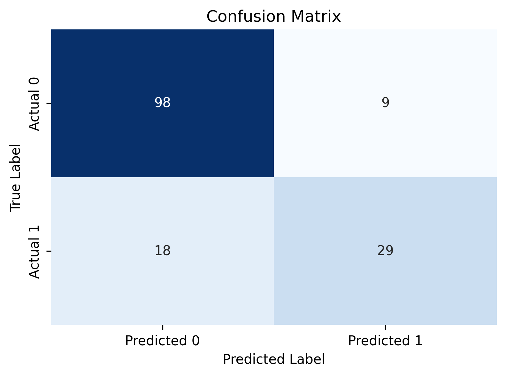

# Diabetes Prediction — Logistic Regression from Scratch
 
Implementing Logistic Regression **from scratch** to understand what happens under the hood — before moving to sklearn library-based implementations.
 
---
 
## What this project covers
 
- Building the sigmoid function manually
- Implementing binary cross-entropy as the cost function
- Running gradient descent to update weights and bias
- Tracking the loss curve to verify convergence
- Evaluating the model with accuracy, precision, recall, and F1 score
scikit-learn is used **only** for data splitting, feature scaling, and evaluation
metrics — not for the model itself.
 
---
 
## Dataset
 
**Pima Indians Diabetes Dataset**
- Source: [Kaggle](https://www.kaggle.com/datasets/uciml/pima-indians-diabetes-database)
- 768 patients, 8 clinical features, binary target (0 = Non-diabetic, 1 = Diabetic)

This dataset contains the following features: 

| Feature | Description |
|---|---|
| Pregnancies | Number of pregnancies |
| Glucose | Plasma glucose concentration (mg/dL) |
| BloodPressure | Diastolic blood pressure (mm Hg) |
| SkinThickness | Triceps skinfold thickness (mm) |
| Insulin | 2-hour serum insulin (μU/mL) |
| BMI | Body mass index |
| DiabetesPedigreeFunction | Diabetes likelihood based on family history |
| Age | Age in years |
 
---
 
## How it works
 
```
Input features (8)
      ↓
  z = Xw + b              (linear combination)
      ↓
  ŷ = 1 / (1 + e^(-z))   (sigmoid → probability)
      ↓
  cost = -1/m · Σ[y·log(ŷ) + (1-y)·log(1-ŷ)]   (binary cross-entropy)
      ↓
  dw = 1/m · Xᵀ(ŷ - y)   (gradient w.r.t weights)
  db = 1/m · Σ(ŷ - y)    (gradient w.r.t bias)
      ↓
  w = w - α·dw            (weight update)
  b = b - α·db            (bias update)
```
 
---
 
## Results

 
| Metric | Score |
|---|---|
| Training Accuracy | ~76.2% |
| Test Accuracy | ~82.5% |
| Precision | ~76.3% |
| Recall | ~61.7% |
| F1 Score | ~68.2% |
 
# Confusion Matrix


---

## Project structure
 
```
diabetes-logistic-regression/
│
├── diabetes_prediction.ipynb   # main notebook
├── diabetes.csv                # dataset
├── Confusion_matrix.png        #saved plot
└── README.md                   #project documentation
```
 
---
 
## How to run
 
1. Clone the repo
```bash
git clone https://github.com/Mahaselvi/diabetes-logistic-regression.git
cd diabetes-logistic-regression
```
 
2. Install dependencies
```bash
pip install numpy pandas matplotlib seaborn scikit-learn
```
 
3. Open the notebook
```bash
jupyter notebook diabetes_prediction.ipynb
```
 
---
 
## What's next
 
- [ ] Implement the same model using sklearn's `LogisticRegression`
- [ ] Try undersampling imbalanced datas
- [ ] Handle zero values in Glucose, BMI, Insulin (biologically impossible)
- [ ] Try Random Forest and XGBoost for comparison
- [ ] Decision boundary visualization
---
 
